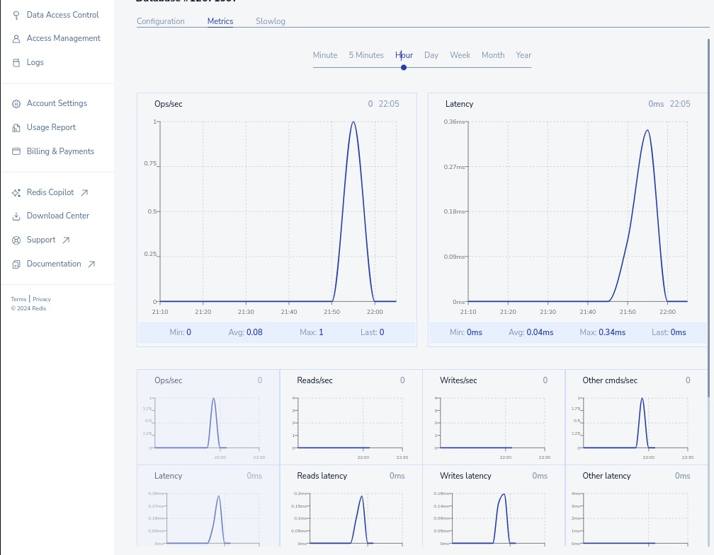

# Weather API .NET

Weather API that fetches and returns wather data.

Source Data: https://www.visualcrossing.com/weather-api

**TechStack: .NET 8, Redis.**

> Recomendations and Tips
- [x] City code entered by the user as the key and save there the result from calling the API. (City name instead)
- [ ] At the same time, when you "set" the value in the cache, you can also give it an expiration time in seconds (using the EX flag on the SET command).
- [x] Start by creating a simple API that returns a hardcoded wather response. This will help you understand how to sctructure you API and how to handle requests.
- [x] Use enviornment variables to store the API key and the Redis connection string. This way, you can easily change them without having to modify your code.
- [x] Make sure to handle errors properly. If the 3rd party API is down, or if the city code is invalid, make sure to return the appropriate error message.
- [x] Use some package or module to make HTTP requests.
- [x] Implement rate limiting to prevent abuse of your API. You can use package like AspNetCoreRateLimit

> Goals: 
 - How to work with 3rd party APIs
 - Caching
 - Environment variables
 - Sctructure API and handle requests

> Resources sample

https://learn.microsoft.com/en-us/aspnet/core/performance/rate-limit?view=aspnetcore-9.0

https://learn.microsoft.com/en-us/aspnet/core/tutorials/min-web-api?view=aspnetcore-8.0&tabs=visual-studio-code
